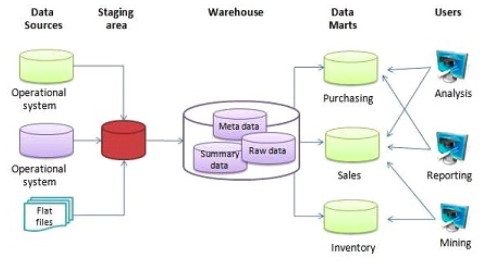
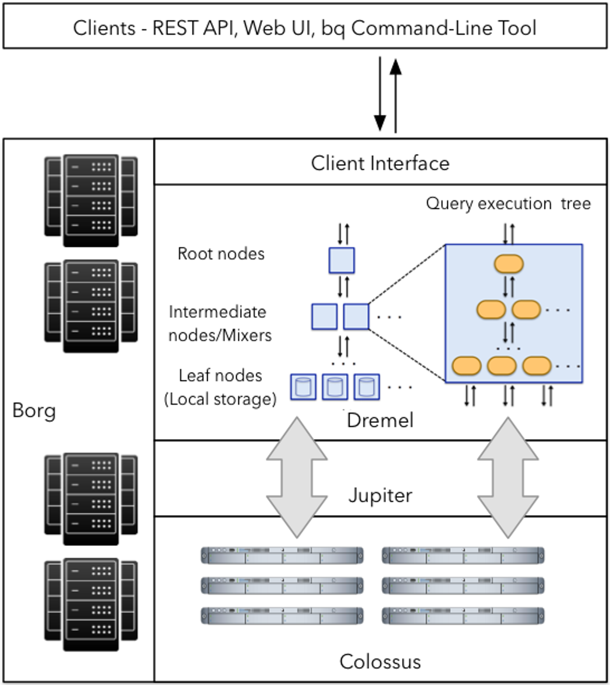
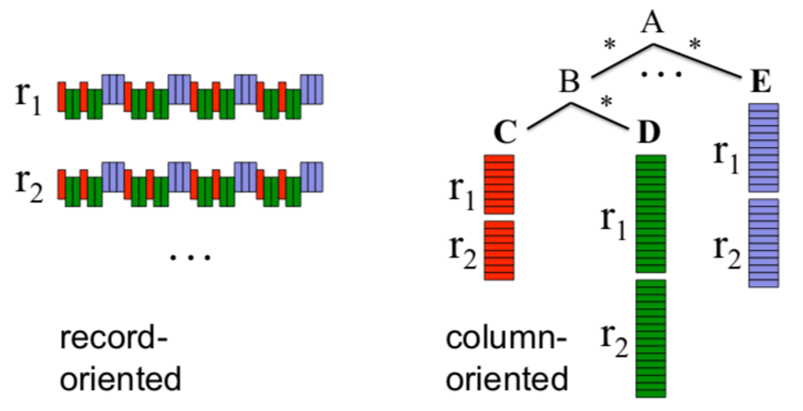
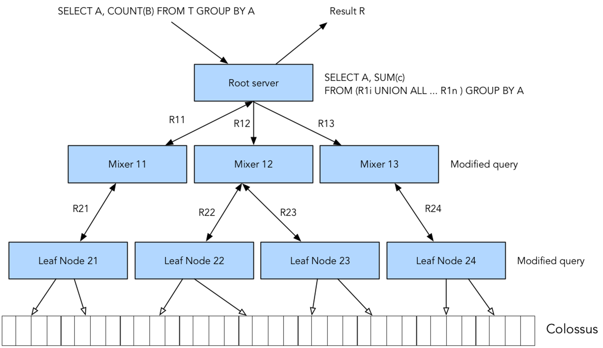

# Week 3: Data Warehouse

- **********OLTP:********** Online Transaction Processing
- ************OLAP:************ Online Analytical Processing

## OLAP vs OLTP

|                     | OLTP                                                                                              | OLAP                                                                             |
| ------------------- | ------------------------------------------------------------------------------------------------- | -------------------------------------------------------------------------------- |
| Purpose             | Control and run essential business operations in real time                                        | Plan, solve problems, support decisions, discover hidden insights                |
| Data updates        | Short, fast updates initiated by user                                                             | Data periodically refreshed with scheduled, long running batch jobs              |
| Database design     | Normalized databases for efficiency                                                               | Denormalized databases for analysis                                              |
| Space requirements  | Generally small if historical data is archived                                                    | Generally large due to aggregating large datasets                                |
| Backup and recovery | Regular backups required to ensure business continuity and meet legal and governance requirements | Lost data can be reloaded for OLTP database as needed in lieu of regular backups |
| Productivity        | Increases productivity of end users                                                               | Increases productivity of business managers, data analysts and executives        |
| Data view           | Lists day-to-day business transitions                                                             | Multi-dimensional view of enterprise data                                        |
| User examples       | Customer-facing personnel, clerks, online shoppers                                                | Knowledge workers such as data analysts, business analysts and executives        |

---

OLTP ⇒ relational databases like PostgreSQL, MySQL, etc.

OLAP ⇒ Data warehouses like BigQuery, Redshift, Snowflake, etc.

## What is a data warehouse

- OLAP solution
- Used for reporting and data analysis



A DW receives data from different _**data sources**_ which is then processed in
a _**staging area**_ before being ingested to the actual warehouse (a database)
and arranged as needed. DWs may then feed data to separate _**Data Marts**_;
smaller database systems which end users may use for different purposes.

---

## BigQuery

- Serverless data warehouse
  - There are no servers to manage or database software to install
- Software as well as infrastructure including
  - **********************scalability********************** and
    **********high-availability**********
- Built-in features like
  - machine learning
  - geospatial analysis
  - business intelligence
- BigQuery maximizes flexibility by separating the compute engine that analyzes
  your data from your storage

## Pricing

BigQuery pricing is divided in 2 main components: processing and storage. There
are also additional charges for other operations such as ingestion or
extraction. The cost of storage is fixed and at the time of writing is US$0.02
per GB per month; you may check the current storage
pricing [in this link](https://cloud.google.com/bigquery/pricing#storage).

- On demand pricing (default):
  - $5 per TB per month; the first TB of the month is free.
- Flat rate pricing: based on the number of pre-requested _slots_ (virtual
  CPUs).
  - A minimum of 100 slots is required for the flat-rate pricing which costs
    US$2,000 per month.
  - Queries take up slots. If you're running multiple queries and run out of
    slots, the additional queries must wait until other queries finish in order
    to free up the slot. On demand pricing does not have this issue.
  - The flat-rate pricing only makes sense when processing more than 400TB of
    data per month.

## External tables

BigQuery supports a
few _[external data sources](https://cloud.google.com/bigquery/external-data-sources)_:
you may query these sources directly from BigQuery even though the data itself
isn't stored in BQ.

An _**external table**_ is a table that acts like a standard BQ table. The table
metadata (such as the schema) is stored in BQ storage but the data itself is
external.

You may create an external table from a CSV or Parquet file stored in a Cloud
Storage bucket:

```sql
CREATE OR REPLACE EXTERNAL TABLE `taxi-rides-ny.nytaxi.external_yellow_tripdata`
OPTIONS (
  format = 'CSV',
  uris = ['gs://nyc-tl-data/trip data/yellow_tripdata_2019-*.csv', 'gs://nyc-tl-data/trip data/yellow_tripdata_2020-*.csv']
);
```

This query will create an external table based on 2 CSV files. BQ will figure
out the table schema and the datatypes based on the contents of the files.

Be aware that BQ cannot determine processing costs of external tables.

You may import an external table into BQ as a regular internal table by copying
the contents of the external table into a new internal table. For example:

```sql
CREATE OR REPLACE TABLE taxi-rides-ny.nytaxi.yellow_tripdata_non_partitoned AS
SELECT * FROM taxi-rides-ny.nytaxi.external_yellow_tripdata;
```

_[Back to the top](https://github.com/ziritrion/dataeng-zoomcamp/blob/main/notes/3_data_warehouse.md#table-of-contents)_

## Partitions

_Video
sources: [1](https://www.youtube.com/watch?v=jrHljAoD6nM&list=PL3MmuxUbc_hJed7dXYoJw8DoCuVHhGEQb&index=25), [2](https://www.youtube.com/watch?v=-CqXf7vhhDs&list=PL3MmuxUbc_hJed7dXYoJw8DoCuVHhGEQb&index=26)_

BQ tables can be _**partitioned**_ into multiple smaller tables. For example, if
we often filter queries based on date, we could partition a table based on date
so that we only query a specific sub-table based on the date we're interested
in.

[Partition tables](https://cloud.google.com/bigquery/docs/partitioned-tables) are
very useful to improve performance and reduce costs, because BQ will not process
as much data per query.

You may partition a table by:

- _**Time-unit column**_: tables are partitioned based on a `TIMESTAMP`, `DATE`,
  or `DATETIME` column in the table.
- _**Ingestion time**_: tables are partitioned based on the timestamp when
  BigQuery ingests the data.
- _**Integer range**_: tables are partitioned based on an integer column.

For Time-unit and Ingestion time columns, the partition may be daily (the
default option), hourly, monthly or yearly.

> Note: BigQuery limits the amount of partitions to 4000 per table. If you need
> more partitions, consider clustering as well.

Here's an example query for creating a partitioned table:

```sql
CREATE OR REPLACE TABLE taxi-rides-ny.nytaxi.yellow_tripdata_partitoned
PARTITION BY
  DATE(tpep_pickup_datetime) AS
SELECT * FROM taxi-rides-ny.nytaxi.external_yellow_tripdata;
```

BQ will identify partitioned tables with a specific icon. The _Details_ tab of
the table will specify the field which was used for partitioning the table and
its datatype.

Querying a partitioned table is identical to querying a non-partitioned table,
but the amount of processed data may be drastically different. Here are 2
identical queries to the non-partitioned and partitioned tables we created in
the previous queries:

```sql
SELECT DISTINCT(VendorID)
FROM taxi-rides-ny.nytaxi.yellow_tripdata_non_partitoned
WHERE DATE(tpep_pickup_datetime) BETWEEN '2019-06-01' AND '2019-06-30';
```

- Query to non-partitioned table.
- It will process around 1.6GB of data

```sql
SELECT DISTINCT(VendorID)
FROM taxi-rides-ny.nytaxi.yellow_tripdata_partitoned
WHERE DATE(tpep_pickup_datetime) BETWEEN '2019-06-01' AND '2019-06-30';
```

- Query to partitioned table.
- It will process around 106MB of data.

You may check the amount of rows of each partition in a partitioned table with a
query such as this:

```sql
SELECT table_name, partition_id, total_rows
FROM `nytaxi.INFORMATION_SCHEMA.PARTITIONS`WHERE table_name = 'yellow_tripdata_partitoned'ORDER BY total_rows DESC;
```

This is useful to check if there are data imbalances and/or biases in your
partitions.

_[Back to the top](https://github.com/ziritrion/dataeng-zoomcamp/blob/main/notes/3_data_warehouse.md#table-of-contents)_

## Clustering

_Video
sources: [1](https://www.youtube.com/watch?v=jrHljAoD6nM&list=PL3MmuxUbc_hJed7dXYoJw8DoCuVHhGEQb&index=25), [2](https://www.youtube.com/watch?v=-CqXf7vhhDs&list=PL3MmuxUbc_hJed7dXYoJw8DoCuVHhGEQb&index=26)_

_**Clustering**_ consists of rearranging a table based on the values of its
columns so that the table is ordered according to any criteria. Clustering can
be done based on one or multiple columns up to 4; the _**order**_ of the columns
in which the clustering is specified is important in order to determine the
column priority.

Clustering may improve performance and lower costs on big datasets for certain
types of queries, such as queries that use filter clauses and queries that
aggregate data.

> Note: tables with less than 1GB don't show significant improvement with
> partitioning and clustering; doing so in a small table could even lead to
> increased cost due to the additional metadata reads and maintenance needed for
> these features.

Clustering columns must be _**top-level**_, _**non-repeated**_ columns. The
following datatypes are supported:

- `DATE`
- `BOOL`
- `GEOGRAPHY`
- `INT64`
- `NUMERIC`
- `BIGNUMERIC`
- `STRING`
- `TIMESTAMP`
- `DATETIME`

A partitioned table can also be clustered. Here's an example query for creating
a partitioned and clustered table:

```sql
CREATE OR REPLACE TABLE taxi-rides-ny.nytaxi.yellow_tripdata_partitoned_clustered
PARTITION BY DATE(tpep_pickup_datetime)
CLUSTER BY VendorID AS
SELECT * FROM taxi-rides-ny.nytaxi.external_yellow_tripdata;
```

Just like for partitioned tables, the _Details_ tab for the table will also
display the fields by which the table is clustered.

Here are 2 identical queries, one for a partitioned table and the other for a
partitioned and clustered table:

```sql
SELECT count(*) as trips
FROM taxi-rides-ny.nytaxi.yellow_tripdata_partitoned
WHERE DATE(tpep_pickup_datetime) BETWEEN '2019-06-01' AND '2020-12-31'AND VendorID=1;
```

- Query to non-clustered, partitioned table.
- This will process about 1.1GB of data.

```sql
SELECT count(*) as trips
FROM taxi-rides-ny.nytaxi.yellow_tripdata_partitoned_clustered
WHERE DATE(tpep_pickup_datetime) BETWEEN '2019-06-01' AND '2020-12-31'AND VendorID=1;
```

- Query to partitioned and clustered data.
- This will process about 865MB of data.

## Partitioning vs Clustering

As mentioned before, you may combine both partitioning and clustering in a
table, but there are important differences between both techniques that you need
to be aware of in order to decide what to use for your specific scenario:

| Clustering                                                                                                                  | Partitioning                                                                                   |
| --------------------------------------------------------------------------------------------------------------------------- | ---------------------------------------------------------------------------------------------- |
| Cost benefit unknown. BQ cannot estimate the reduction in cost before running a query.                                      | Cost known upfront. BQ can estimate the amount of data to be processed before running a query. |
| High granularity. Multiple criteria can be used to sort the table.                                                          | Low granularity. Only a single column can be used to partition the table.                      |
| Clusters are "fixed in place".                                                                                              | Partitions can be added, deleted, modified or even moved between storage options.              |
| Benefits from queries that commonly use filters or aggregation against multiple particular columns.                         | Benefits when you filter or aggregate on a single column.                                      |
| Unlimited amount of clusters; useful when the cardinality of the number of values in a column or group of columns is large. | Limited to 4000 partitions; cannot be used in columns with larger cardinality.                 |

### Clustering over partitioning

- Partitioning results in a small amount of data per partition (approximately
  less than 1GB)
- Partitioning results in a large number of partitions beyond the limits on
  partitioned tables (4000 partitions)
- Partitioning results in your mutation operations modifying the majority of
  partitions in the table frequently ((for example, writing to the table every
  few minutes and writing to most of the partitions each time rather than just a
  handful).

### Automatic reclustering

As data is added to a clustered table

- The newly inserted data can be written to block that contain key ranges that
  overlap with the key ranges in previously written blocks
- These overlapping keys weaken the sort property of the table

To maintain the performance characteristics of a clustered table

- BigQuery performs automatic re-clustering in the background to restore the
  sort property of the table
- For partitioned tables, clustering is maintained for data within the scope of
  each partition.

## Best Practice

- Cost reduction
  - Avoid `SELECT *` . Reducing the amount of columns to display will
    drastically reduce the amount of processed data and lower costs.
  - Price your queries before running them.
  - Use clustered and/or partitioned tables if possible.
  - Use [streaming inserts](https://cloud.google.com/bigquery/streaming-data-into-bigquery) with
    caution. They can easily increase cost.
  - [Materialize query results](https://cloud.google.com/bigquery/docs/materialized-views-intro) in
    different stages.
- Query performance
  - Filter on partitioned columns.
  - [Denormalize data](https://cloud.google.com/blog/topics/developers-practitioners/bigquery-explained-working-joins-nested-repeated-data).
  - Use [nested or repeated columns](https://cloud.google.com/blog/topics/developers-practitioners/bigquery-explained-working-joins-nested-repeated-data).
  - Use external data sources appropiately. Constantly reading data from a
    bucket may incur in additional costs and has worse performance.
  - Reduce data before using a `JOIN`.
  - Do not threat `WITH` clauses
    as [prepared statements](https://www.wikiwand.com/en/Prepared_statement).
  - Avoid [oversharding tables](https://cloud.google.com/bigquery/docs/partitioned-tables#dt_partition_shard).
  - Avoid JavaScript user-defined functions.
  - Use [approximate aggregation functions](https://cloud.google.com/bigquery/docs/reference/standard-sql/approximate_aggregate_functions) rather
    than complete ones such
    as [HyperLogLog++](https://cloud.google.com/bigquery/docs/reference/standard-sql/hll_functions).
  - Order statements should be the last part of the query.
  - [Optimize join patterns](https://cloud.google.com/bigquery/docs/best-practices-performance-compute#optimize_your_join_patterns).
  - Place the table with the _largest_ number of rows first, followed by the
    table with the _fewest_ rows, and then place the remaining tables by
    decreasing size.
    - This is due to how BigQuery works internally: the first table will be
      distributed evenly and the second table will be broadcasted to all the
      nodes.

## BigQuery Internals

_[Additional source](https://cloud.google.com/blog/products/data-analytics/new-blog-series-bigquery-explained-overview)_

While it's not strictly necessary to understand how the internals of BigQuery
work, it can be useful to know in order to understand the reasoning behind
the best practices.

## BigQuery Architecture

BigQuery is built on 4 infrastructure technologies.

- _**Dremel**_: the _compute_ part of BQ. It executes the SQL queries.
  - Dremel turns SQL queries into _execution trees_. The leaves of these trees
    are called _slots_ and the branches are called _mixers_.
  - The _slots_ are in charge of reading data from storage and perform
    calculations.
  - The _mixers_ perform aggregation.
  - Dremel dynamically apportions slots to queries as needed, while maintaining
    fairness for concurrent queries from multiple users.
- _**Colossus**_: Google's global storage system.
  - BQ leverages a _columnar storage format_ and compression algorithms to store
    data.
  - Colossus is optimized for reading large amounts of structured data.
  - Colossus also handles replication, recovery and distributed management.
- _**Jupiter**_: the network that connects Dremel and Colossus.
  - Jupiter is an in-house network technology created by Google which is used
    for interconnecting its data centers.
- _**Borg**_: an orchestration solution that handles everything.
  - Borg is a precursor of Kubernetes.



## Column-oriented vs record-oriented storage

Traditional methods for tabular data storage are _**record-oriented**_ (also
known as _row-oriented_). Data is read sequentially row by row and then the
columns are accessed per row. An example of this is a CSV file: each new line in
the file is a record and all the info for that specific record is contained
within that line.

BigQuery uses a _**columnar storage format**_. Data is stored according to the
columns of the table rather than the rows. This is beneficial when dealing with
massive amounts of data because it allows us to discard right away the columns
we're not interested in when performing queries, thus reducing the amount of
processed data.



When performing queries, Dremel modifies them in order to create an _execution
tree_: parts of the query are assigned to different mixers which in turn assign
even smaller parts to different slots which will access Colossus and retrieve
the data.

The columnar storage format is perfect for this workflow as it allows very fast
data retrieval from colossus by multiple workers, which then perform any needed
computation on the retrieved datapoints and return them to the mixers, which
will perform any necessary aggregation before returning that data to the root
server, which will compose the final output of the query.


